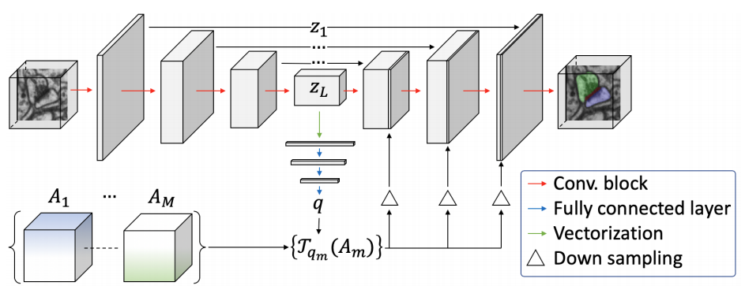
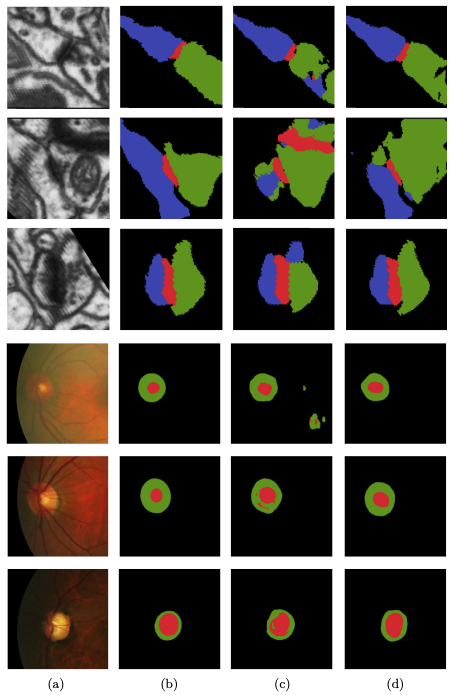

# Probabilistic Atlases to Enforce Topological Constraints (MICCAI 2019)

This repository is a PyTorch implementation of Voxel2Mesh architecture proposed in *Probabilistic Atlases to Enforce Topological Constraints*; Udaranga Wickramasinghe, Graham Knott and Pascal Fua; MICCAI 2019

## Abstract 
Probabilistic atlases (PAs) have long been used in standard segmentation approaches and, more recently, in conjunction with Convolutional Neural Networks (CNNs). However, their use has been restricted to relatively standardized structures such as the brain or heart which have limited or predictable range of deformations. Here we propose an encoding-decoding CNN architecture that can exploit rough atlases that encode only the topology of the target structures that can appear in any pose and have arbitrarily complex shapes to improve the segmentation results. It relies on the output of the encoder to compute both the pose parameters used to deform the atlas and the segmentation mask itself, which makes it effective and end-to-end trainable.

## Architecture


Fig. 1. PA-Net architecture. The network takes as input an image and a list of PAs.
Given the decoder output, the fully connected layers estimate the parameters of the
affine transformation that registers the PAs to the input. The registered PAs are then
concatenated with the features computed by the convolutional decoder at each scale.



Fig. 2. U-Net vs PA-Net. Top three rows depict results from synaptic junction segmentation. The bottom three rows depict results from retinal fundus image segmentation. (a) Input images, (b) Ground-truth, (c) U-Net results (d) PA-Net results. The
color hues denote the same areas as those in Fig. 1 (best viewed in color).

## Requirements

1. Python 3.6 or later
2. pytorch 1.0.0 or later  

## Running experiments

execute : ```python main.py```

## Contact
For any questions regard this paper/code, please directly contact [Udaranga Wickramasinghe](mailto:udaranga.wickramasinghe@epfl.ch).

